# Project Nirvana — Data Model & Schema Architecture

This document specifies the relational data model for **Project Nirvana**, a holistic wellness platform facilitating live, time-based sessions across Yoga, Reiki, Psychotherapy, Pranic Healing, Astrology, Sound Healing, and spiritual mentorship.

---

## 1. Entity Relationship Diagram (ERD)

```mermaid
erDiagram
    User ||--o| ProviderProfile : "owns"
    User ||--o{ Booking : "books as consumer"
    User ||--o{ Booking : "attends as provider"
    User ||--o{ Review : "writes as consumer"
    User ||--o{ Review : "receives as provider"
    User ||--o{ Conversation : "participates as consumer"
    User ||--o{ Conversation : "participates as provider"
    User ||--o{ Message : "sends"
    User ||--o{ Notification : "receives"
    User ||--o{ Dispute : "raises"
    User ||--o{ Report : "files as reporter"
    User ||--o{ Report : "receives as reported"
    User ||--o{ AuditLog : "triggers"
    User ||--o{ ConsentRecord : "grants"

    ProviderProfile ||--o{ Service : "offers"
    ProviderProfile ||--o{ Credential : "submits"
    ProviderProfile ||--o{ ProviderCategory : "specializes in"
    ProviderProfile ||--o{ AvailabilityRule : "schedules weekly"
    ProviderProfile ||--o{ AvailabilityException : "blocks or adds"
    ProviderProfile ||--o{ Payout : "receives"

    Category ||--o{ Subcategory : "contains"
    Category ||--o{ ProviderCategory : "categorizes"
    Category ||--o{ Service : "classifies"

    Service ||--o{ Booking : "scheduled via"

    Booking ||--o{ Payment : "funded by"
    Booking ||--o| Session : "conducts via Daily.co"
    Booking ||--o| Review : "evaluated by"
    Booking ||--o| Dispute : "disputed in"
    Booking ||--o{ LedgerEntry : "records financial events"
    Booking ||--o{ Report : "referenced by"

    Payout ||--o{ LedgerEntry : "disburses"

    Conversation ||--o{ Message : "contains"

    User {
        uuid id PK
        string email UK
        string phone
        string passwordHash
        enum role "CONSUMER | PROVIDER | ADMIN"
        enum status "ACTIVE | SUSPENDED | DELETED"
        string timeZone "IANA e.g. Asia/Kolkata"
        string locale
        datetime emailVerifiedAt
        datetime createdAt
        datetime updatedAt
        datetime deletedAt "Soft delete"
    }

    ProviderProfile {
        uuid id PK
        uuid userId FK,UK
        string displayName
        string slug UK
        string headline
        string bio
        string introVideoUrl
        string_array languages
        int yearsExperience
        string country
        string city
        enum verificationTier "UNVERIFIED | ID_VERIFIED | CREDENTIAL_VERIFIED | BACKGROUND_CHECKED"
        enum approvalStatus "DRAFT | PENDING | APPROVED | REJECTED | SUSPENDED"
        decimal ratingAvg
        int ratingCount
        string payoutAccountId "Razorpay Route ID"
        int bufferMinutes "Rest buffer between slots"
        datetime createdAt
        datetime updatedAt
    }

    Category {
        uuid id PK
        string name
        string slug UK
        string description
        string icon
        boolean requiresLicense "e.g. Psychotherapy mandates clinical license"
        int commissionBps "Basis points e.g. 1500 = 15.00%"
        boolean isActive
        datetime createdAt
        datetime updatedAt
    }

    Subcategory {
        uuid id PK
        uuid categoryId FK
        string name
        string slug
        datetime createdAt
        datetime updatedAt
    }

    ProviderCategory {
        uuid providerId FK,PK
        uuid categoryId FK,PK
        boolean isPrimary
        datetime createdAt
    }

    Credential {
        uuid id PK
        uuid providerId FK
        enum type "DEGREE | CERTIFICATION | LICENSE | ACCREDITATION"
        string title
        string issuer
        string documentUrl "Signed S3 URL"
        enum status "PENDING | VERIFIED | REJECTED"
        uuid reviewedBy FK
        datetime reviewedAt
        datetime expiresAt
        datetime createdAt
        datetime updatedAt
    }

    Service {
        uuid id PK
        uuid providerId FK
        uuid categoryId FK
        string title
        string description
        int durationMin
        int priceAmount "Integer in smallest unit (paise)"
        string currency "INR"
        enum mode "ONLINE | IN_PERSON | BOTH"
        boolean isGroup
        int maxParticipants
        boolean isActive
        enum cancellationPolicy "FLEXIBLE | MODERATE | STRICT"
        datetime createdAt
        datetime updatedAt
    }

    AvailabilityRule {
        uuid id PK
        uuid providerId FK
        enum weekday "MONDAY..SUNDAY"
        string startTime "HH:MM"
        string endTime "HH:MM"
        string providerTimeZone
        boolean isActive
        datetime createdAt
        datetime updatedAt
    }

    AvailabilityException {
        uuid id PK
        uuid providerId FK
        datetime startAt "UTC"
        datetime endAt "UTC"
        boolean isBlocked "true=vacation/blocked, false=extra slot"
        string reason
        datetime createdAt
        datetime updatedAt
    }

    Booking {
        uuid id PK
        uuid consumerId FK
        uuid providerId FK
        uuid serviceId FK
        datetime startAt "UTC"
        datetime endAt "UTC"
        enum status "PENDING_PAYMENT | CONFIRMED | COMPLETED | CANCELLED_BY_CONSUMER | CANCELLED_BY_PROVIDER | NO_SHOW_CONSUMER | NO_SHOW_PROVIDER | DISPUTED | REFUNDED"
        int priceSnapshot "Paise"
        string currency
        int commissionBps "Commission snapshot"
        string notes "Confidential intake notes"
        datetime slotLockExpiresAt "Checkout reservation lock"
        datetime createdAt
        datetime updatedAt
    }

    Payment {
        uuid id PK
        uuid bookingId FK
        enum gateway "RAZORPAY | STRIPE"
        string gatewayOrderId UK
        string gatewayPaymentId UK
        int amount "Paise"
        string currency
        enum status "PENDING | AUTHORIZED | CAPTURED | FAILED | REFUNDED"
        int refundedAmount "Paise"
        datetime createdAt
        datetime updatedAt
    }

    Payout {
        uuid id PK
        uuid providerId FK
        int amount "Paise"
        string currency
        enum status "PENDING | PROCESSING | PAID | FAILED"
        string gatewayTransferId UK "Razorpay Route Transfer"
        datetime scheduledFor "UTC"
        datetime processedAt "UTC"
        datetime createdAt
        datetime updatedAt
    }

    LedgerEntry {
        uuid id PK
        uuid bookingId FK
        uuid payoutId FK
        enum entryType "CREDIT | DEBIT"
        enum accountType "CONSUMER_PAYMENT | PLATFORM_ESCROW | PLATFORM_REVENUE | PROVIDER_PAYABLE | GATEWAY_FEE | REFUND_ESCROW"
        int amount "Paise"
        string currency
        string description
        datetime createdAt
    }

    Session {
        uuid id PK
        uuid bookingId FK,UK
        string videoRoomName "Daily.co Room"
        datetime startedAt "UTC"
        datetime endedAt "UTC"
        datetime joinedByConsumerAt "UTC"
        datetime joinedByProviderAt "UTC"
        datetime createdAt
        datetime updatedAt
    }

    Review {
        uuid id PK
        uuid bookingId FK,UK
        uuid consumerId FK
        uuid providerId FK
        int rating "1..5"
        string comment
        string providerReply
        boolean isPublished
        datetime createdAt
        datetime updatedAt
    }

    Conversation {
        uuid id PK
        uuid bookingId FK
        uuid consumerId FK
        uuid providerId FK
        datetime createdAt
        datetime updatedAt
    }

    Message {
        uuid id PK
        uuid conversationId FK
        uuid senderId FK
        string ciphertext "Encrypted at rest"
        string iv "AES-256-GCM IV"
        string authTag
        boolean isEncrypted
        datetime readAt
        datetime createdAt
    }

    Notification {
        uuid id PK
        uuid userId FK
        string type
        string title
        string body
        json data
        datetime readAt
        datetime createdAt
    }

    Dispute {
        uuid id PK
        uuid bookingId FK,UK
        uuid raisedById FK
        string reason
        enum status "OPEN | UNDER_REVIEW | RESOLVED_REFUND | RESOLVED_RELEASE | DISMISSED"
        string adminNotes
        string resolutionNotes
        datetime resolvedAt
        datetime createdAt
        datetime updatedAt
    }

    Report {
        uuid id PK
        uuid reporterId FK
        uuid reportedUserId FK
        uuid bookingId FK
        string category
        string reason
        enum status "PENDING | INVESTIGATING | ACTIONED | DISMISSED"
        datetime createdAt
        datetime updatedAt
    }

    AuditLog {
        uuid id PK
        uuid userId FK
        string action
        string entityType
        string entityId
        string ipAddress
        string userAgent
        json metadata
        datetime createdAt
    }

    ConsentRecord {
        uuid id PK
        uuid userId FK
        enum consentType "TERMS_OF_SERVICE | PRIVACY_POLICY | DATA_PROCESSING | HEALTH_DATA_CONSENT | MARKETING"
        string version
        string ipAddress
        string userAgent
        datetime grantedAt
        datetime revokedAt
    }
```



---

## 2. Core Design Decisions & Engineering Trade-offs

### 1. PostgreSQL Exclusion Constraint (Zero Overlapping Slots)

- **Problem**: In concurrent booking environments, two consumers can simultaneously checkout the same provider slot. Application-level mutexes or locks across distributed servers often leak or degrade throughput.
- **Solution**: Project Nirvana enforces a PostgreSQL GiST Exclusion Constraint on `bookings`:
  ```sql
  CREATE EXTENSION IF NOT EXISTS btree_gist;

  ALTER TABLE "bookings"
  ADD CONSTRAINT "no_overlapping_provider_bookings"
  EXCLUDE USING gist (
    provider_id WITH =,
    tstzrange(start_at, end_at) WITH &&
  )
  WHERE (status IN ('CONFIRMED', 'PENDING_PAYMENT'));
  ```
- **Trade-off**: Requires the `btree_gist` extension in PostgreSQL, but delivers 100% mathematical guarantees against double-bookings directly in the storage engine without distributed lock complexity.

---

### 2. Double-Entry Financial Ledger (`LedgerEntry`)

- **Problem**: Direct balance mutation (`provider.balance += payout`) creates reconciliation nightmares, lacks historical audibility, and fails during disputes or chargebacks.
- **Solution**: Every rupee moving through Project Nirvana generates immutable `LedgerEntry` records:
  - Consumer pays: `DEBIT CONSUMER_PAYMENT` / `CREDIT PLATFORM_ESCROW`
  - Session completes: `DEBIT PLATFORM_ESCROW` / `CREDIT PLATFORM_REVENUE` (15%) + `CREDIT PROVIDER_PAYABLE` (85%)
  - Payout executed: `DEBIT PROVIDER_PAYABLE` / `CREDIT RAZORPAY_ROUTE`
- **Trade-off**: Requires more inserts per booking lifecycle, but yields enterprise-grade accounting and financial auditability.

---

### 3. Strict UTC Storage + Separate IANA Timezones

- **Rule**: Every `DateTime` column is persisted strictly in **UTC**.
- **User Experience**: The user's IANA timezone (`Asia/Kolkata`, `America/New_York`, `Europe/London`) is stored in `User.timeZone` and `AvailabilityRule.providerTimeZone`.
- **Benefit**: Booking slot calculations, daylight saving transitions, and global booking comparisons remain unambiguous and immune to server time skew.

---

### 4. Integer Money in Smallest Currency Unit (Paise)

- **Rule**: No floating-point numbers (`Float` / `Double`) for money.
- **Representation**: Stored as integers in smallest units (`priceAmount`, `amount`, `refundedAmount` in paise for INR; e.g. INR 2,500.00 is stored as `250000`).
- **Benefit**: Eliminates IEEE 754 floating-point rounding errors during commission calculation and payout splitting.

---

### 5. Sensitive Mental Health Data & Encryption at Rest

- **Rule**: Consultation notes in `Booking.notes` and messages in `Message.ciphertext` contain sensitive personal health information.
- **Implementation**:
  - `Message` stores `ciphertext`, `iv`, and `authTag` (AES-256-GCM).
  - Backend Pino logging explicitly censors `sessionNotes`, `notes`, `messageContent`, and `ciphertext`.
  - Mental health therapist sessions require strict verified credentials (`requiresLicense: true` on `Category`).

---

### 6. Slot Reservation Locks (`slotLockExpiresAt`)

- During the checkout funnel (when consumer opens payment modal), a `Booking` is created with status `PENDING_PAYMENT` and `slotLockExpiresAt = NOW() + 10 MINUTES`.
- Combined with the exclusion constraint, this holds the provider's slot exclusively.
- If payment succeeds, status becomes `CONFIRMED`. If payment expires or fails, a BullMQ job transitions it to `CANCELLED_BY_CONSUMER`, releasing the slot for other seekers.
